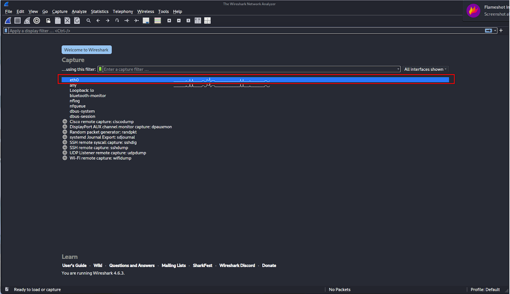
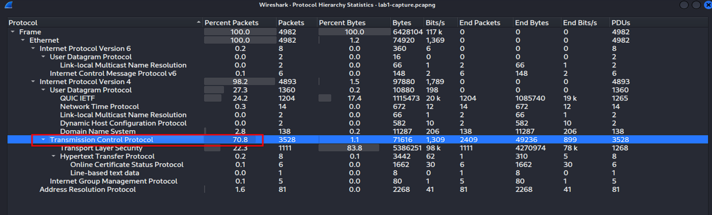
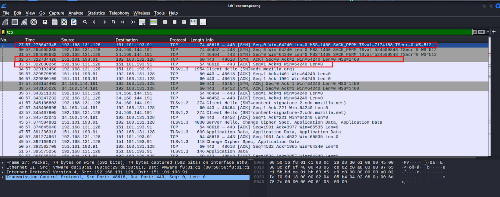
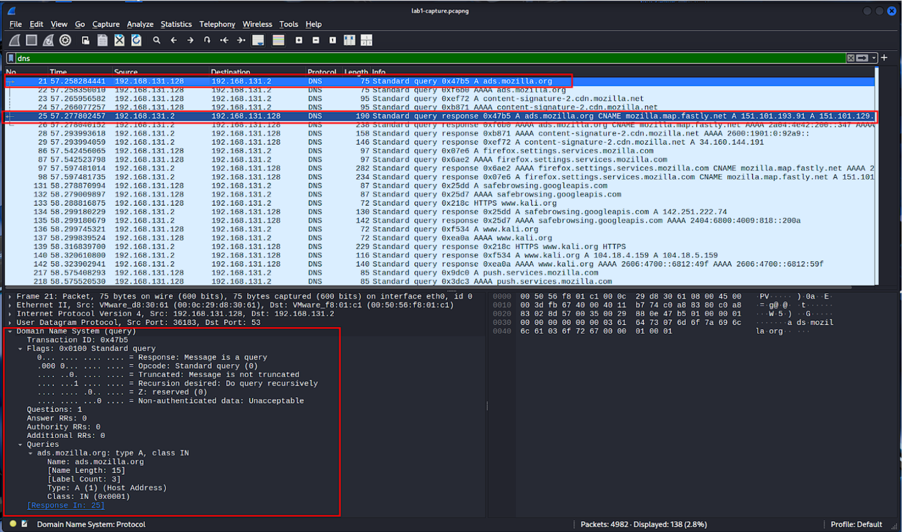
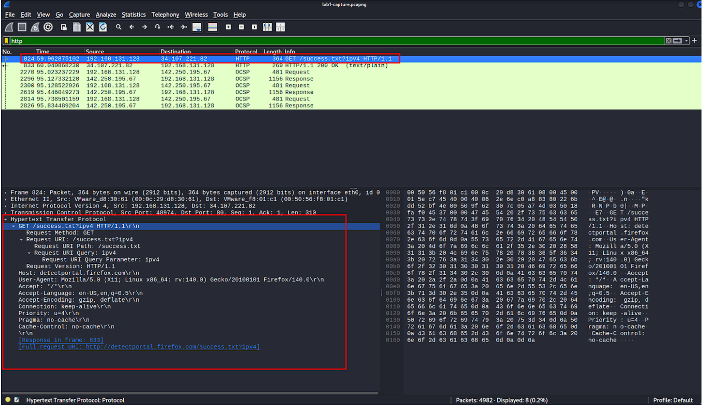

# Basic Packet Capture and Protocol Analysis 

## Objective
To learn the basics of packet capture and analyze standard network protocols (TCP, DNS, HTTP) using Wireshark.

## Skills Learned
- Network traffic sniffing and packet capture.
- Implementing Wireshark display filters to isolate specific traffic.
- Understanding and verifying the TCP 3-way handshake.
- Inspecting DNS query/response cycles and cleartext HTTP headers.

## Tools Used
- Wireshark
- Kali Linux (VMware Workstation)

## Steps Performed

### 1. Launch and Interface Selection
Identified and selected the `eth0` network interface. The live, increasing packet counters confirmed active network traffic.

### 2. Analyze Protocol Distribution
Navigated to Statistics > Protocol Hierarchy and identified Transmission Control Protocol (TCP) as the dominant protocol under IPv4, accounting for 70.8% of the total packet traffic.

### 3. Analyze TCP Handshake
Applied the `tcp` display filter to isolate TCP traffic and successfully identified a complete three-way handshake sequence (SYN, SYN-ACK, ACK) between the Kali VM and a destination server.

### 4. Analyze DNS Queries
Applied the `dns` display filter and examined a DNS query packet requesting the A record for the domain `ads.mozilla.org`, along with its corresponding response resolving to an IP address.

### 5. Analyze HTTP Traffic
Applied the `http` display filter to identify an HTTP GET request and expanded the Hypertext Transfer Protocol pane to view headers, verifying a successful 200 OK status code.

---
> **📄 Full Documentation:** For the complete step-by-step procedure, and all verification screenshots, please refer to the attached [Lab Report PDF](Lab%20Report_%20Basic%20Packet%20Capture%20and%20Protocol$20Analysis%20with$20Wireshark.pdf) included in this repository.
